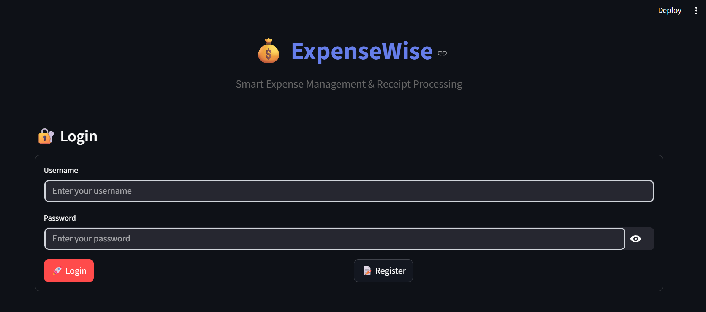
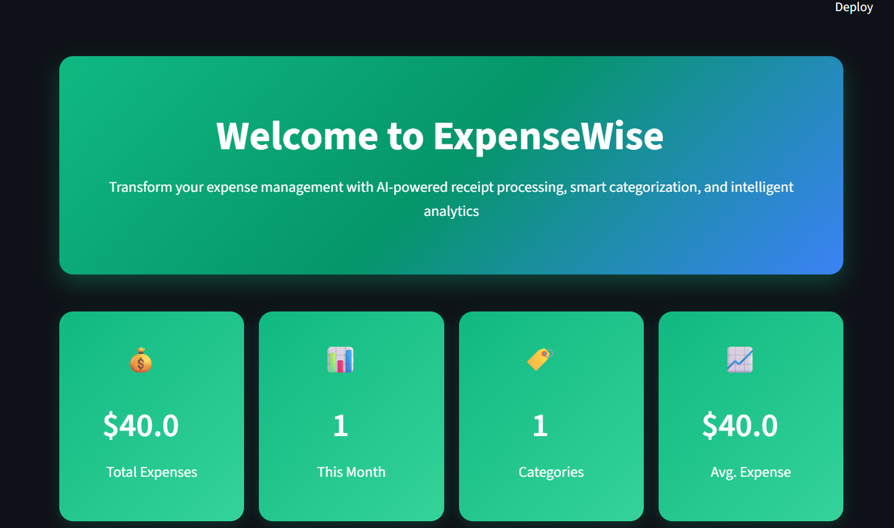
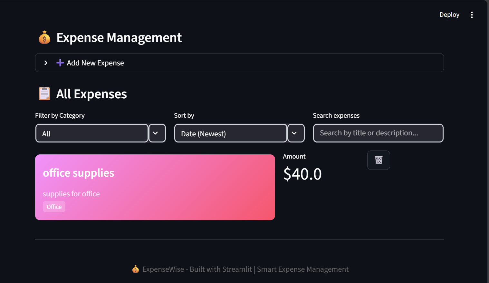
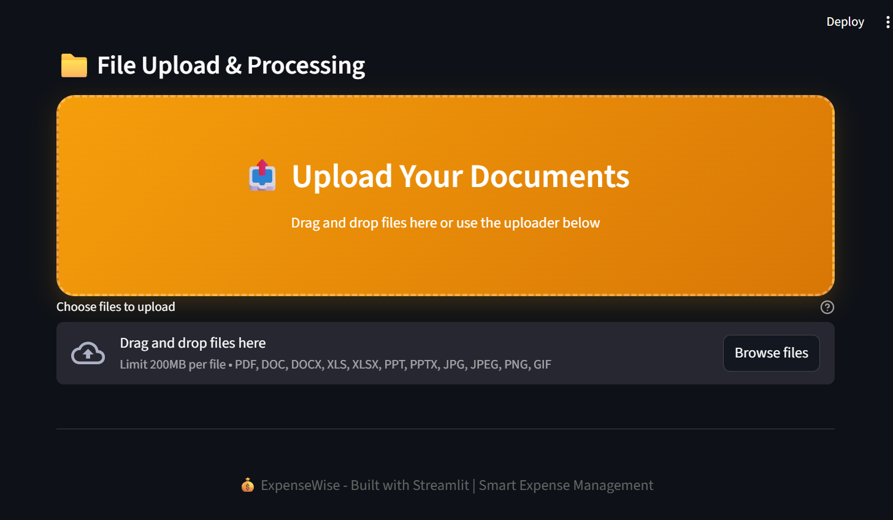
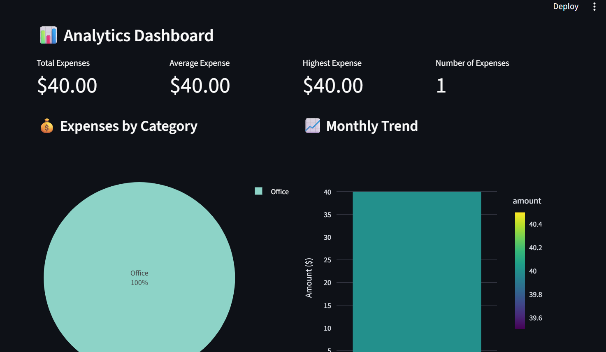
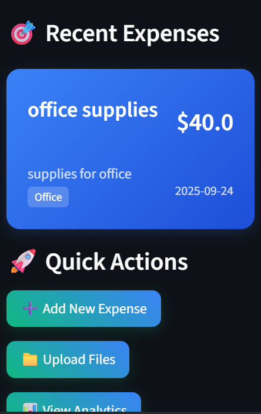

# 💰 ExpenseWise - Smart Expense Management & Receipt Processing

<div align="center">
  
  
  
  
  
</div>

<div align="center">
  <h3>🚀 <a href="https://web-production-c954e.up.railway.app/">Live Demo</a> | 📱 <a href="https://github.com/zainab318/expenseWise">GitHub Repository</a></h3>
</div>

## 🎯 Overview

**ExpenseWise** is a modern, AI-powered expense management application that helps users track expenses, process receipts, and gain insights into their spending patterns. Built with Streamlit and featuring a beautiful financial-themed UI, it provides an intuitive interface for personal and business expense management.

## ✨ Key Features

### 🏠 **Smart Dashboard**
- Real-time expense tracking and analytics
- Visual spending insights with interactive charts
- Quick expense entry and management
- Financial health metrics

### 💰 **Expense Management**
- Add, edit, and delete expenses
- Categorize expenses with custom categories
- Receipt attachment and storage
- Date-based filtering and sorting

### 📁 **AI-Powered Receipt Processing**
- Drag-and-drop file upload
- OCR (Optical Character Recognition) for receipt text extraction
- Automatic expense data extraction
- Smart categorization suggestions

### 📊 **Analytics & Insights**
- Interactive charts and graphs
- Spending trends analysis
- Category-wise expense breakdown
- Monthly and yearly reports

### 🔐 **User Authentication**
- Secure user registration and login
- Session management
- User-specific data isolation

## 🎨 Design Highlights

### **Financial-Themed UI/UX**
- **Color Scheme**: Professional green, blue, and orange gradients
- **Modern Cards**: Beautiful shadows and hover effects
- **Responsive Design**: Works on desktop, tablet, and mobile
- **Smooth Animations**: Enhanced user experience

### **Visual Elements**
- 💰 Money bag icons and financial symbols
- 📊 Interactive charts and graphs
- 🎯 Clean, professional layout
- 🌈 Gradient backgrounds and buttons

## 🚀 Quick Start

### 🌐 **Try the Live Demo**
**Visit the live application:** [https://web-production-c954e.up.railway.app/](https://web-production-c954e.up.railway.app/)

### 💻 **Local Development**

#### Prerequisites
- Python 3.8 or higher
- pip (Python package installer)

#### Installation

1. **Clone the repository**
   ```bash
   git clone https://github.com/zainab318/expenseWise.git
   cd expenseWise
   ```

2. **Install dependencies**
   ```bash
   pip install -r requirements.txt
   ```

3. **Run the application**
   ```bash
   streamlit run streamlit_app.py
   ```

4. **Access the app**
   - Open your browser and go to `http://localhost:8501`
   - Register a new account or login

## 📱 Screenshots

### **Login Page**

*Clean, professional login interface with financial-themed design*

### **Dashboard Overview**

*Main dashboard showing expense metrics, recent transactions, and quick actions*

### **Expense Management**

*Add, edit, and manage expenses with intuitive forms*

### **File Upload & AI Processing**

*Drag-and-drop receipt upload with AI-powered text extraction*

### **Analytics Dashboard**

*Interactive charts and spending insights*

### **Mobile Responsive Design**

*Fully responsive design that works on all devices*

## 🛠️ Technical Stack

### **Frontend**
- **Streamlit**: Modern web app framework
- **Custom CSS**: Financial-themed styling
- **Plotly**: Interactive charts and graphs
- **Responsive Design**: Mobile-first approach

### **Backend**
- **Python**: Core application logic
- **SQLite**: Lightweight database
- **AI Processing**: OCR and text extraction
- **Session Management**: Secure user authentication

### **Key Dependencies**
```
streamlit>=1.28.0
plotly>=5.15.0
pandas>=2.0.0
pillow>=10.0.0
python-multipart>=0.0.6
```

## 🚀 Deployment

### **Live Application**
**🌐 [https://web-production-c954e.up.railway.app/](https://web-production-c954e.up.railway.app/)**

This application is currently deployed on **Railway** and is live for public use.

### **Deploy Your Own Instance**

#### **Railway (Recommended)**
1. **Fork this repository**
2. **Go to [Railway.app](https://railway.app)**
3. **Connect your GitHub account**
4. **Deploy from GitHub repository**
5. **Select your forked `expenseWise` repository**
6. **Railway will automatically deploy your app**

#### **Other Platforms**
- **Render**: Free tier with 750 hours/month
- **Heroku**: Easy deployment process
- **Vercel**: Great for static sites

## 📊 Features in Detail

### **Smart Expense Tracking**
- **Quick Entry**: Add expenses in seconds
- **Categories**: Organize by type (Food, Travel, Business, etc.)
- **Amounts**: Support for multiple currencies
- **Dates**: Automatic date tracking
- **Notes**: Detailed expense descriptions

### **AI Receipt Processing**
- **Upload**: Drag-and-drop receipt images
- **OCR**: Extract text from receipts
- **Extraction**: Automatically extract amounts, dates, merchants
- **Categorization**: Smart category suggestions
- **Validation**: Manual review and correction

### **Analytics & Reports**
- **Charts**: Interactive spending visualizations
- **Trends**: Monthly and yearly comparisons
- **Categories**: Breakdown by expense type
- **Export**: Download reports as CSV/PDF

### **User Management**
- **Registration**: Simple sign-up process
- **Login**: Secure authentication
- **Sessions**: Persistent login state
- **Privacy**: User-specific data isolation

## 🎯 Use Cases

### **Personal Finance**
- Track daily expenses
- Budget planning and monitoring
- Receipt organization
- Tax preparation support

### **Small Business**
- Expense reporting
- Receipt management
- Financial analytics
- Team expense tracking

### **Freelancers**
- Project expense tracking
- Client billing support
- Tax deduction management
- Financial reporting

## 🔧 Configuration

### **Environment Variables**
```bash
# Database configuration
DATABASE_URL=sqlite:///expensewise.db

# AI processing settings
AI_ENABLED=true
OCR_LANGUAGE=en

# Security settings
SESSION_TIMEOUT=86400
SECRET_KEY=your-secret-key
```

### **Customization**
- **Colors**: Modify CSS variables in `streamlit_app.py`
- **Categories**: Add custom expense categories
- **Features**: Enable/disable specific functionality
- **Themes**: Customize the visual appearance

## 📈 Performance

### **Optimizations**
- **Lazy Loading**: Load data on demand
- **Caching**: Session state management
- **Database**: Efficient SQLite queries
- **Images**: Optimized file handling

### **Scalability**
- **Database**: Easy migration to PostgreSQL
- **Caching**: Redis integration ready
- **CDN**: Static asset optimization
- **Monitoring**: Built-in performance tracking

## 🤝 Contributing

We welcome contributions! Please see our [Contributing Guidelines](CONTRIBUTING.md) for details.

### **Development Setup**
1. Fork the repository
2. Create a feature branch
3. Make your changes
4. Test thoroughly
5. Submit a pull request

### **Code Style**
- Follow PEP 8 guidelines
- Use meaningful variable names
- Add docstrings to functions
- Include type hints

## 📄 License

This project is licensed under the MIT License - see the [LICENSE](LICENSE) file for details.

## 🙏 Acknowledgments

- **Streamlit Team**: For the amazing web app framework
- **Plotly**: For beautiful interactive charts
- **Open Source Community**: For inspiration and tools
- **Contributors**: For their valuable contributions

## 📞 Support

- **Documentation**: [Wiki](https://github.com/yourusername/expensewise/wiki)
- **Issues**: [GitHub Issues](https://github.com/yourusername/expensewise/issues)
- **Discussions**: [GitHub Discussions](https://github.com/yourusername/expensewise/discussions)
- **Email**: support@expensewise.app

## 🎉 Getting Started

Ready to start managing your expenses? Here's how:

1. **Visit the live app**: [https://web-production-c954e.up.railway.app/](https://web-production-c954e.up.railway.app/)
2. **Register**: Create your account
3. **Add expenses**: Start tracking your spending
4. **Upload receipts**: Use AI to process receipts
5. **View analytics**: Understand your spending patterns

---

<div align="center">
  <p><strong>💰 ExpenseWise - Smart Expense Management Made Simple</strong></p>
  <p>🌐 <a href="https://web-production-c954e.up.railway.app/">Live Demo</a> | 📱 <a href="https://github.com/zainab318/expenseWise">GitHub</a></p>
  <p>Built with ❤️ using Streamlit and Python</p>
</div>